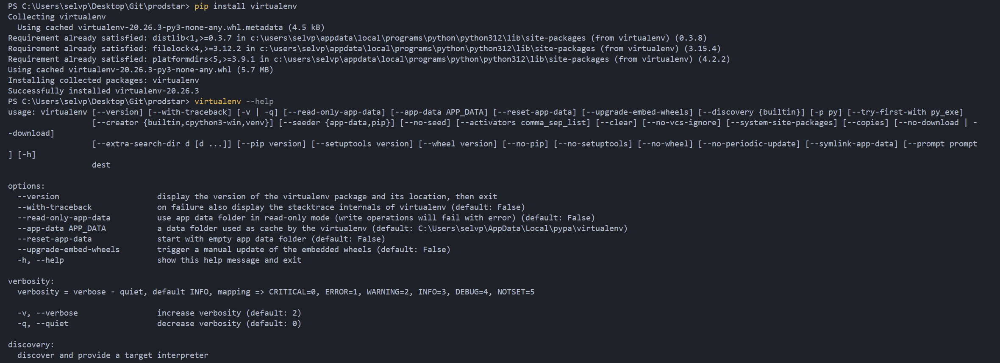
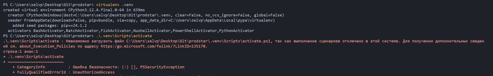
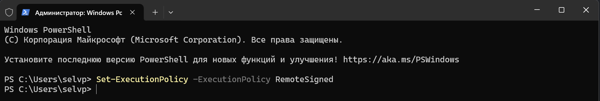
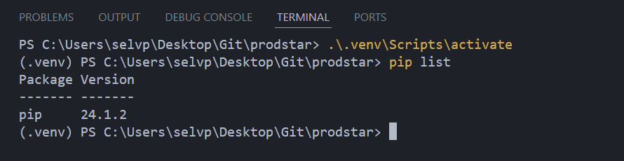

# Материалы и домашки ProductStar

> [!NOTE]
> Материалы по Markdown: 
[Doka Guide](https://doka.guide/tools/markdown/), [Docs Github](https://docs.github.com/ru/get-started/writing-on-github/getting-started-with-writing-and-formatting-on-github/basic-writing-and-formatting-syntax)

| Микропроект | Описание | Комментарий |
|------|------|------|
|pictureDownloader | Выполняет скачивание случайной картинки, соответствующей введенному запросу | Используется Pixabay API. Ключ получен при регистрации. Для доступа к Pixabay и возможности выполнения запросов требуется VPN |
| videogamseDatasetAnalysis | Выполненный анализ по датасету о продажах видеоигр в соответствии с домашним заданием | Используется библиотека Pandas. Датасет: `./resources/datasets/vgsales.csv` (загружен с сайта [kaggle.com](https://www.kaggle.com/datasets/gregorut/videogamesales)) |
---
### Виртуальная среда проекта

#### Использование модуля venv
|Настройка виртуального окружения |Подсказка |
|------|------|
|Установка `venv`: <ul><li>`sudo apt install -y python3-venv `</li><li>`sudo apt install -y build-essential libssl-dev libffi-dev python3-dev`</li><li>`python3 -m venv venv` - запуск модуля `venv` и создание каталога `venv`, хранящего зависимости проекта (виртуальной среды)</li><li>`venv\Scripts\activate.bat` - активация виртуальной среды (ОС Windows) или `source venv/bin/activate` (ОС Linux)</li></ul> |  |
|`pip freeze > requirements.txt` - вывод перечня установленных пакетов в файл `requirements.txt`|  |
|`pip install -r requirements.txt` - установка зависимостей проекта, указанных в файле `requirements.txt`| |

#### Использование инструмента [virtualenv](https://virtualenv.pypa.io/en/latest/installation.html)
| Настройка виртуального окружения | Подсказка |
|------|------|
|Установка: <ul><li>`pip install virtualenv` - выполнить установку инструмента `virtualenv`</li><li>`virtualenv --help` - вывести справочную информацию об инструменте</li></ul>  | |
|Создание и активация окружения: <ul><li>Создание среды (создает папку в вашем текущем каталоге): `virtualenv env_name`</li>Активация новой среды Python (Windows): `.\env_name\Scripts\activate`<li><ul><li>Возможно, потребуется применить [политику выполнения PowerShell](https://learn.microsoft.com/ru-ru/powershell/module/microsoft.powershell.core/about/about_execution_policies?view=powershell-7.4) (необходимо для запуска скрипта активации виртуального окружения): `Set-ExecutionPolicy -ExecutionPolicy RemoteSigned`</li></ul></li><li>Установка модулей в виртуальное окружение: `pip install <module>` или `pip install -r requirement.txt`, если в файле уже указаны необходимые зависимости. Указание флага `-U` или `--upgrade` обновит все пакеты до последней доступной версии</li></ul> | |
---
### Полезные ресурсы
| Ресурс | Описание |
|---|---|
| [PyPi.org](https://pypi.org/) | Хранилище пакетов для языка программирования Python |

### Статьи и материалы
| Ресурс                                                                              | Комментарий |
|-------------------------------------------------------------------------------------|-------------|
| [Установка пакетов (PyPi, Git, Local storage) и настройка виртуального окружения](https://packaging.python.org/en/latest/tutorials/installing-packages/) |             |
