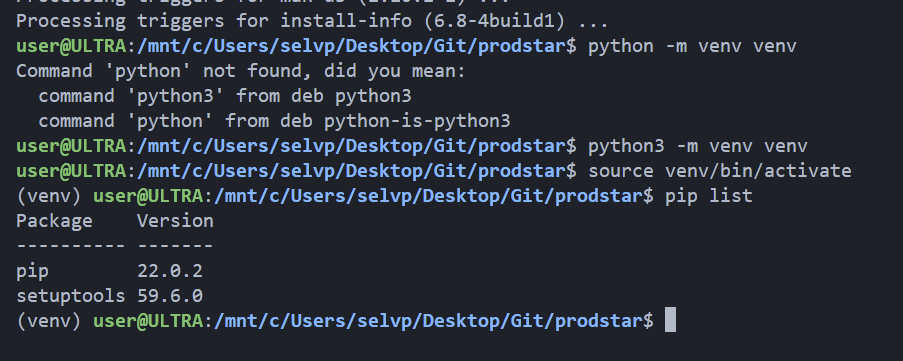
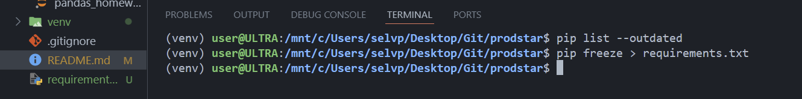
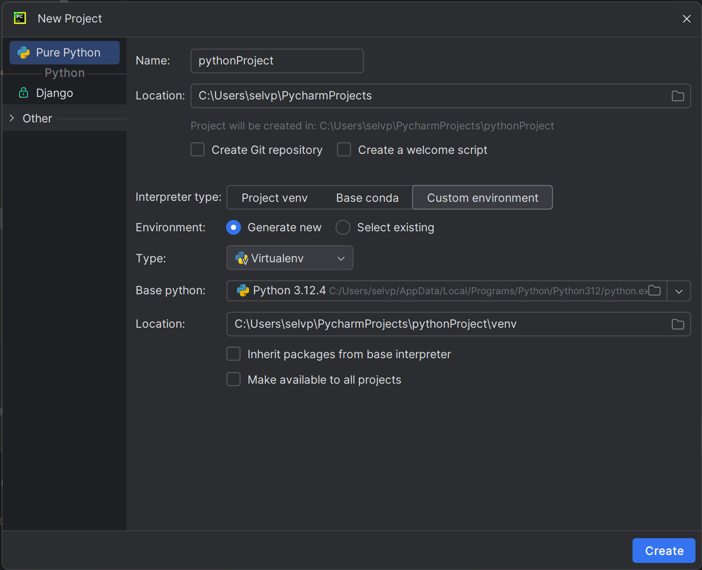
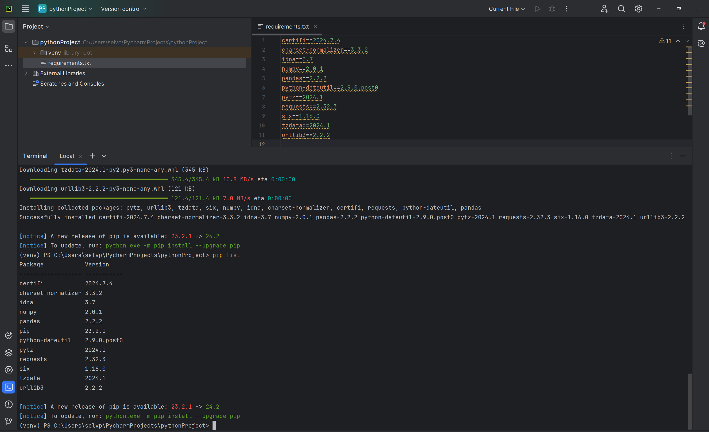

# Материалы и домашки ProductStar

> [!NOTE]
> Материалы по Markdown: 
[Doka Guide](https://doka.guide/tools/markdown/), [Docs Github](https://docs.github.com/ru/get-started/writing-on-github/getting-started-with-writing-and-formatting-on-github/basic-writing-and-formatting-syntax)

| Микропроект | Описание | Комментарий |
|------|------|------|
|pictureDownloader | Выполняет скачивание случайной картинки, соответствующей введенному запросу | Используется Pixabay API. Ключ получен при регистрации. Для доступа к Pixabay и возможности выполнения запросов требуется VPN |
| videogamseDatasetAnalysis | Выполненный анализ по датасету о продажах видеоигр в соответствии с домашним заданием | Используется библиотека Pandas. Датасет: `./resources/datasets/vgsales.csv` (загружен с сайта [kaggle.com](https://www.kaggle.com/datasets/gregorut/videogamesales)) |

### Виртуальная среда проекта

| Настройка виртуального окружения | Подсказка |
|------|------|
| <ul><li>`sudo apt install -y python3-venv `</li><li>`sudo apt install -y build-essential libssl-dev libffi-dev python3-dev`</li><li>`python3 -m venv venv` - запуск модуля `venv` и создание каталога `venv`, хранящего зависимости проекта (виртуальной среды)</li><li>`venv\Scripts\activate.bat` - активация виртуальной среды (ОС Windows) или `source venv/bin/activate` (ОС Linux)</li></ul> |  |
| <ul><li>`pip freeze > requirements.txt` - вывод перечня установленных пакетов в файл `requirements.txt`</li></ul> |  |
|`pip install -r requirements.txt` - установка зависимостей проекта, указанных в файле `requirements.txt`| |