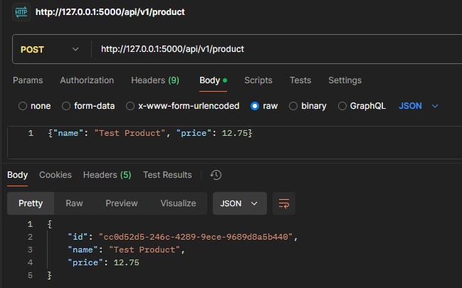
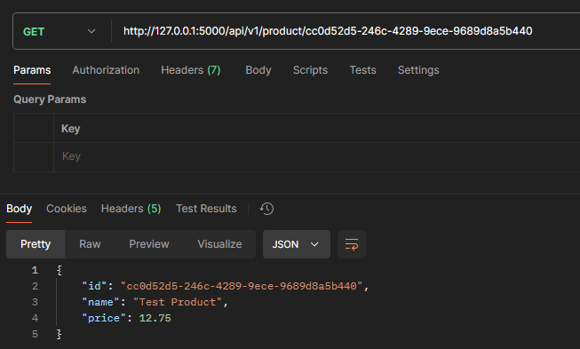
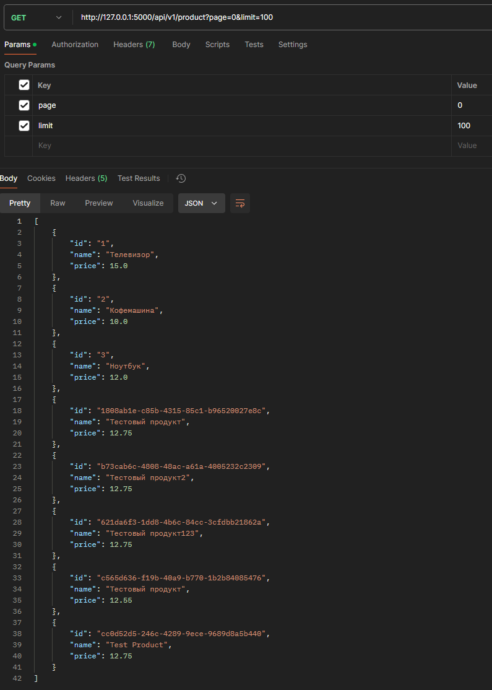
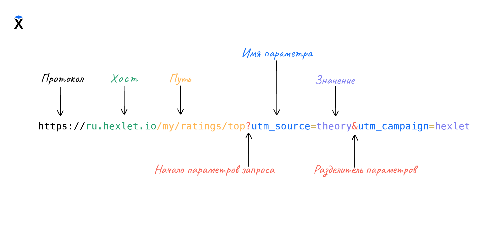
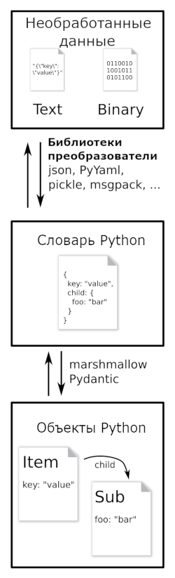

### Задание

Вам предстоит доработать интернет-магазин, который мы реализовывали на воркшопе.

Необходимо:

* Реализовать API для создания продукта;
* Реализовать API для получения страницы продуктов;
* Реализовать API для получения продукта по его ID;
* Описать инструкцию (readme.md), в ней должно быть описано:
  * как запустить сервер;
  * как создать продукт;
  * как получить все продукты;
  * как получить продукт по id.

### Run

* Install `virtualenv`
* Run virtual environment by `virtualenv env`
* Activate virtual environment `.\env\Scripts\activate`
* Run command `pip install -r requirements.txt`
* Run command from the project root directory `py main.py`

### Test

#### Using CURL (Windows)
| Request Type | Example | Description |
|---|---|---|
| GET | `curl.exe 'http://127.0.0.1:5000/api/v1/product/1808ab1e-c85b-4315-85c1-b96520027e8c'` | Get product with id = '1808ab1e-c85b-4315-85c1-b96520027e8c' |
| GET | `curl.exe 'http://127.0.0.1:5000/api/v1/product?page=0&limit=10'` | Get first 10 products from storage. Increase limit to get all products from storage |
| POST | `curl.exe -X POST -H 'Content-Type: application/json' -d '{\"name\": \"Test product\", \"price\": 12.75}' http://127.0.0.1:5000/api/v1/product` | Create product with name 'Test product' and price 12.75 |

#### Using POSTMAN
##### Create product


##### Get product by id


##### Get page with products / All products


### Query String


### CURL

Main options:
* `-H` - передать заголовки на сервер;
* `-d` - отправить данные методом POST;

| Request Type | Example |
|---|---|
| GET | `curl http://localhost:5000` |
| POST | `curl -X POST -H 'Content-Type: application/json' -d '{}' http://localhost:5000` |
| PATCH | `curl -X PATCH http://localhost:5000 -H 'Content-Type: application/json' -d '{"User": "Leo", "Id": 1}'` |
| PUT | `curl -X PUT [URL] -H "Content-Type: [content type]" -d "[request data]"` |
| DELETE | `curl -X DELETE http://reqbin.com/echo/delete/json?id=1 -H "Accept: application/json"` |

### [Marshmallow](https://marshmallow.readthedocs.io/en/stable/quickstart.html)
Библиотека для управления преобразования сырых данных в сложные объекты Python и наоборот, а также валидации данных на соответствие определенным программистом схемам

In short, marshmallow schemas can be used to:

* Validate input data.
* Deserialize input data to app-level objects.
* Serialize app-level objects to primitive Python types. The serialized objects can then be rendered to standard formats such as JSON for use in an HTTP API.



#### Schema
Simple Python User Class
```python
class User:
    name: str
    email: str
    created_at: dt.datetime = field(default_factory=dt.datetime.now)
```

Create a schema by defining a class with variables mapping attribute names to Field objects.
```python
from marshmallow import Schema, fields


class UserSchema(Schema):
    name = fields.Str()
    email = fields.Email()
    created_at = fields.DateTime()
```

#### Serialization
Serialize objects by passing them to your schema’s dump method, which returns the formatted result.
##### Format output
```python
from pprint import pprint

user = User(name="Monty", email="monty@python.org")
schema = UserSchema()
result = schema.dump(user)
pprint(result)
# {"name": "Monty",
#  "email": "monty@python.org",
#  "created_at": "2014-08-17T14:54:16.049594+00:00"}
```
##### JSON output
You can also serialize to a JSON-encoded string using dumps.
```python
json_result = schema.dumps(user)
print(json_result)
# '{"name": "Monty", "email": "monty@python.org", "created_at": "2014-08-17T14:54:16.049594+00:00"}'
```
##### Filtering output
You may not need to output all declared fields every time you use a schema. You can specify which fields to output with the only parameter.
```python
summary_schema = UserSchema(only=("name", "email"))
summary_schema.dump(user)
# {"name": "Monty", "email": "monty@python.org"}
```
You can also exclude fields by passing in the exclude parameter.


#### Deserialization
The reverse of the dump method is load, which validates and deserializes an input dictionary to an application-level data structure.

##### Source to Map
By default, load will return a dictionary of field names mapped to deserialized values (or raise a ValidationError with a dictionary of validation errors)

```python
from pprint import pprint

user_data = {
    "created_at": "2014-08-11T05:26:03.869245",
    "email": "ken@yahoo.com",
    "name": "Ken",
}
schema = UserSchema()
result = schema.load(user_data)
pprint(result)
# {'name': 'Ken',
#  'email': 'ken@yahoo.com',
#  'created_at': datetime.datetime(2014, 8, 11, 5, 26, 3, 869245)},
```
Notice that the datetime string was converted to a datetime object.

##### Source to Object
In order to deserialize to an object, define a method of your Schema and decorate it with post_load. The method receives a dictionary of deserialized data.
```python
from marshmallow import Schema, fields, post_load


class UserSchema(Schema):
    name = fields.Str()
    email = fields.Email()
    created_at = fields.DateTime()

    @post_load
    def make_user(self, data, **kwargs):
        return User(**data)
```
Now, the load method return a User instance.


```python
user_data = {"name": "Ronnie", "email": "ronnie@stones.com"}
schema = UserSchema()
result = schema.load(user_data)
print(result)  # => <User(name='Ronnie')>
```

#### Handling collections of objects
Set `many=True` when dealing with iterable collections of objects.

```python
user1 = User(name="Mick", email="mick@stones.com")
user2 = User(name="Keith", email="keith@stones.com")
users = [user1, user2]
schema = UserSchema(many=True)
result = schema.dump(users)  # OR UserSchema().dump(users, many=True)
pprint(result)
# [{'name': u'Mick',
#   'email': u'mick@stones.com',
#   'created_at': '2014-08-17T14:58:57.600623+00:00'}
#  {'name': u'Keith',
#   'email': u'keith@stones.com',
#   'created_at': '2014-08-17T14:58:57.600623+00:00'}]
```

#### Validation
Schema.load (and its JSON-decoding counterpart, Schema.loads) raises a ValidationError error when invalid data are passed in. You can access the dictionary of validation errors from the ValidationError.messages attribute. The data that were correctly deserialized are accessible in ValidationError.valid_data. Some fields, such as the Email and URL fields, have built-in validation.

```python
from marshmallow import ValidationError

try:
    result = UserSchema().load({"name": "John", "email": "foo"})
except ValidationError as err:
    print(err.messages)  # => {"email": ['"foo" is not a valid email address.']}
    print(err.valid_data)  # => {"name": "John"}
```

When validating a collection, the errors dictionary will be keyed on the indices of invalid items.

```python
from pprint import pprint

from marshmallow import Schema, fields, ValidationError


class BandMemberSchema(Schema):
    name = fields.String(required=True)
    email = fields.Email()


user_data = [
    {"email": "mick@stones.com", "name": "Mick"},
    {"email": "invalid", "name": "Invalid"},  # invalid email
    {"email": "keith@stones.com", "name": "Keith"},
    {"email": "charlie@stones.com"},  # missing "name"
]

try:
    BandMemberSchema(many=True).load(user_data)
except ValidationError as err:
    pprint(err.messages)
    # {1: {'email': ['Not a valid email address.']},
    #  3: {'name': ['Missing data for required field.']}}
```

You can perform additional validation for a field by passing the validate argument. There are a number of built-in validators in the marshmallow.validate module.

```python
from pprint import pprint

from marshmallow import Schema, fields, validate, ValidationError


class UserSchema(Schema):
    name = fields.Str(validate=validate.Length(min=1))
    permission = fields.Str(validate=validate.OneOf(["read", "write", "admin"]))
    age = fields.Int(validate=validate.Range(min=18, max=40))


in_data = {"name": "", "permission": "invalid", "age": 71}
try:
    UserSchema().load(in_data)
except ValidationError as err:
    pprint(err.messages)
    # {'age': ['Must be greater than or equal to 18 and less than or equal to 40.'],
    #  'name': ['Shorter than minimum length 1.'],
    #  'permission': ['Must be one of: read, write, admin.']}
```
You may implement your own validators. A validator is a callable that accepts a single argument, the value to validate. If validation fails, the callable should raise a ValidationError with a useful error message or return False (for a generic error message).

```python
from marshmallow import Schema, fields, ValidationError


def validate_quantity(n):
    if n < 0:
        raise ValidationError("Quantity must be greater than 0.")
    if n > 30:
        raise ValidationError("Quantity must not be greater than 30.")


class ItemSchema(Schema):
    quantity = fields.Integer(validate=validate_quantity)


in_data = {"quantity": 31}
try:
    result = ItemSchema().load(in_data)
except ValidationError as err:
    print(err.messages)  # => {'quantity': ['Quantity must not be greater than 30.']}
```
